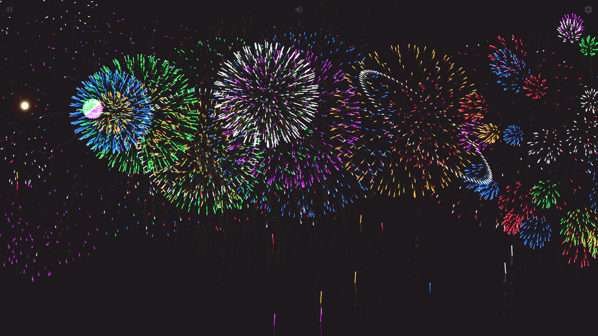

# 花火シミュレーター

様々な花火効果をシミュレートできるウェブページ | 色とりどりの美しい花火効果を表示し、まるで本物の花火の輝かしい世界にいるかのような体験を提供します。| 花火シミュレーション | 花火ウェブ | 花火が咲く | 花火エフェクト

## プレビュー

- [https://nianbroken.github.io/Firework_Simulator/](https://nianbroken.github.io/Firework_Simulator/ "https://nianbroken.github.io/Firework_Simulator/")

- [https://fireworks.nianbroken.top/](https://fireworks.nianbroken.top/ "https://fireworks.nianbroken.top/")

## 文字花火

- `js` → `script.js` の81行目で、文字花火の文字を変更できます。

- `js` → `script.js` の93行目で、花火の背景を変更できます。

- `js` → `script.js` の151行目で、デフォルトで文字花火を有効にするかどうかを変更できます。

